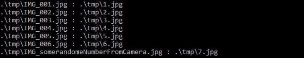
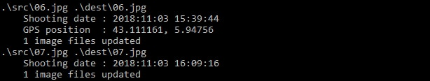

# Windows scripts

## Necessary tools

- [ExifTool](http://owl.phy.queensu.ca/~phil/exiftool/) _(tested with version 11.23)_

## Commands list

- [Add gps position](##add_gps_position.bat) : Add custom gps position (latitude and longitude) to each picture of a folder.  
- [Rename files](##rename_files.bat) : Rename a set of files using a given pattern.  
- [Retrieve metadata](##retrieve_metadata.bat) : Copy metadata for each picture of a folder to each picture (with the same name) in an other folder.

## add_gps_position.bat

**Mandatory parameters :**

1. ImagesfolderToUse  
2. Latitude  
3. Longitude  

**Optional parameters :**

- -latRef : Indicates what hemisphere to use. By default the script use north hemisphere, if the latitude is negative use `-latRef S` and the absolute value of latitude  
- -longRef : Indicates what longitude axis to use. By default the script use east axis, if the longitude is negative use `-longRef W` and the absolute value of longitude  
- -ext : Indicates the extension file to look at. By default the script use `.jpg` extension

**Examples :**  
Add the gps coordinates : 43.087062 6.159426  
`add_gps_position.bat .\dest 43.087062 6.159426`  
   
Add the gps coordinates : 48.378117 -4.503119  
`add_gps_position.bat .\dest 48.378117 4.503119 -longRef W`  
   
Add the gps coordinates : -22.814939 -42.891446  
`add_gps_position.bat .\dest 22.814939 42.891446 -latRef S -longRef W`  
   
Add the gps following coordinates to all ".jpeg" files : 43.619170 7.074131  
`add_gps_position.bat .\dest 43.619170 7.074131 -ext jpeg`  
   

## rename_files.bat

**Mandatory parameters :**

1. ImagesFolderToUse  

**Optional parameters :**

- -v : Display every file modifications
- -base : Indicates the base name to use. By default the script doesn't use base name, files will be renamed with a number : "1.jpg" "2.jpg" ...  
- -ext : Indicates the extension file to look at. By default the script use `.jpg` extension

**Examples :**  
ⓘ For following examples we have 10 files :  

- IMG_001.jpg
- IMG_002.jpg
- IMG_003.jpg
- IMG_004.jpg
- IMG_005.jpg
- IMG_006.jpg
- IMG_somerandomeNumberFromCamera.jpg
- pngTest.png
- somePng1.png
- whyNotPng.png

Rename all files (jpg files) :  
`rename_files.bat .\tmp -v`  
   
Rename all png files with base name "Mes images" :  
`rename_files.bat .\tmp -base "Mes images" -v -ext png`
 

## retrieve_metadata.bat

**Mandatory parameters :**

1. ImagesfolderWithData  
2. ImagesFolderWithoutData

**Optional parameters :**

- -v : Display every file modifications  
- -ext : Indicates the extension file to look at. By default the script use `.jpg` extension

**Examples :**  
Copy the metadata of the files from the "src" folder to files with the same name in the "dest" folder :  
`retrieve_metadata.bat .\src .\dest -v`
   
Copy the metadata of ".jpeg" files from "src" to "dest" :  
`retrieve_metadata.bat .\src .\dest -ext jpeg`  
   